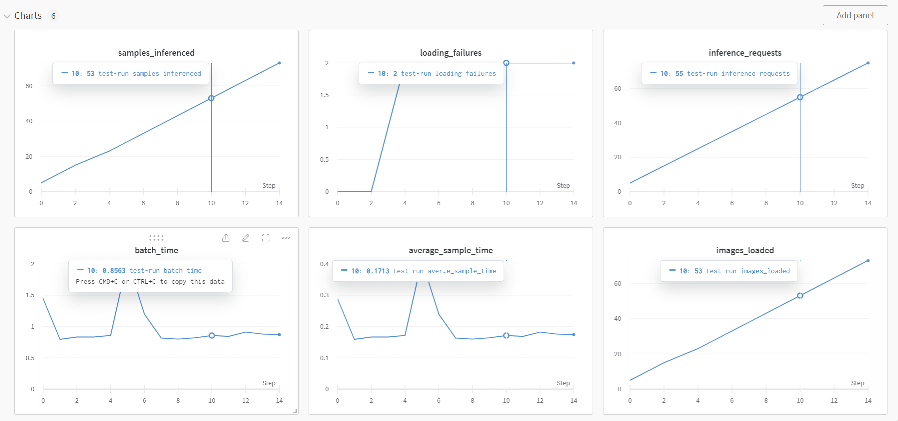
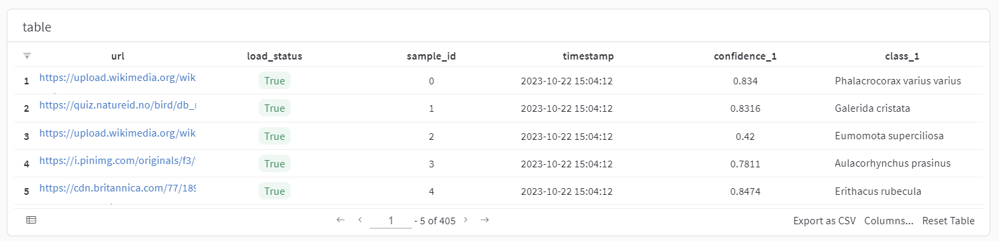
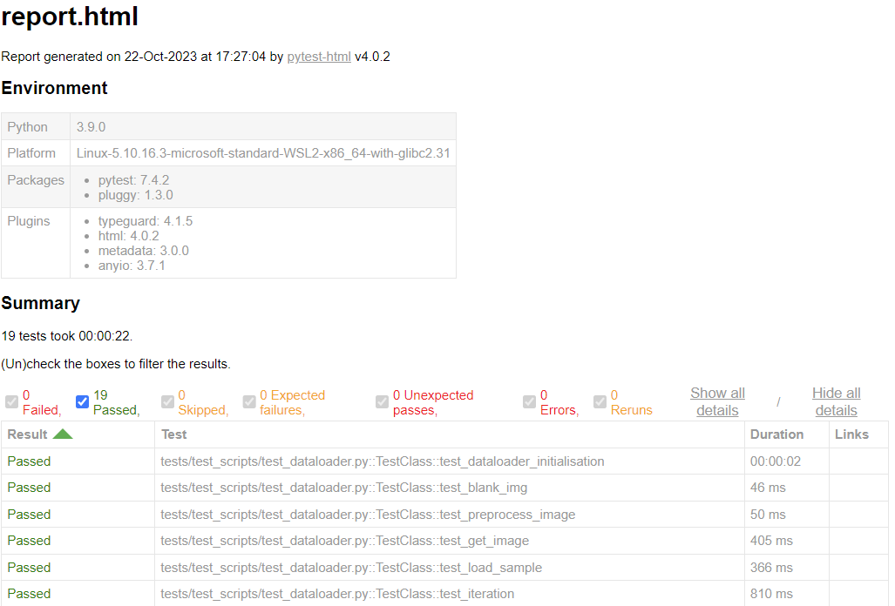

# Bird Classifier App


An installable Python module application that serves a TensorHub model through an API to classify bird images. It uses FastAPI for API endpoints, supports logging, testing with pytest, and can be run in a Docker container.

## Features

- Classify bird images using a pre-trained model.
- FastAPI-based API for easy integration into other applications.
- Logging for tracking model performance.
- Testing with pytest and HTML reporting.
- Docker containerization for deployment.

## Getting Started

### Prerequisites

- Python 3.9
- Conda (recommended for environment management)
- Docker (for containerization)

### Installation

1. Clone the repository:

    ```bash
    git clone https://github.com/ConnorMcShane/bird-classifier-app.git
    cd bird-classifier-app
    ```
2. Create a Conda environment (recommended):

    ```bash
    conda create -n bird-classifier-app python=3.9
    conda activate bird-classifier-app
    ```
3. Install dependencies:

    ```bash
    pip install -r requirements.txt
    pip install .
    ```
## Usage
To start the Bird Classifier App, use the following command:

```bash
uvicorn app:app --log-config=log_config.yaml
```

The app will be available at http://127.0.0.1:8000. You can use the API endpoint /classify to classify birds in images.

## API Documentation
### Classify Birds
- Endpoint: /classify
- Method: POST
- Request Payload: JSON with a dictionary of image URLs.
- Response: JSON with the classified bird species.

#### Example:

```json
{
  "data": {
    "0": "https://upload.wikimedia.org/wikipedia/commons/8/81/Eumomota_superciliosa.jpg",
    "1": "https://i.pinimg.com/originals/f3/fb/92/f3fb92afce5ddff09a7370d90d021225.jpg",
    "2": "https://cdn.britannica.com/77/189277-004-0A3BC3D4.jpg"
  }
}
```

#### Response

```json
{
  "data": {
    "0": {
      "url": "https://upload.wikimedia.org/wikipedia/commons/8/81/Eumomota_superciliosa.jpg",
      "loaded": "True",
      "match_001": {
        "class_name": "Eumomota superciliosa",
        "confidence": "0.4200115"
      },
      "match_002": {
        "class_name": "Momotus coeruliceps",
        "confidence": "0.058062438"
      },
      "match_003": {
        "class_name": "Momotus lessonii",
        "confidence": "0.04923585"
      }
    },
    "1": {
      "url": "https://i.pinimg.com/originals/f3/fb/92/f3fb92afce5ddff09a7370d90d021225.jpg",
      "loaded": "True",
      "match_001": {
        "class_name": "Aulacorhynchus prasinus",
        "confidence": "0.7811297"
      },
      "match_002": {
        "class_name": "Cyanocorax yncas",
        "confidence": "0.12734191"
      },
      "match_003": {
        "class_name": "Chlorophanes spiza",
        "confidence": "0.013746255"
      }
    },
    "2": {
      "url": "https://cdn.britannica.com/77/189277-004-0A3BC3D4.jpg",
      "loaded": "True",
      "match_001": {
        "class_name": "Erithacus rubecula",
        "confidence": "0.8473688"
      },
      "match_002": {
        "class_name": "Ixoreus naevius",
        "confidence": "0.0031131657"
      },
      "match_003": {
        "class_name": "Setophaga tigrina",
        "confidence": "0.0026399055"
      }
    }
  }
}
```

## Logging
The Bird Classifier App uses Python's logging module to log model performance. The log file is located in the logs directory.

### Weight and Biases
Weights and Biases is also used to log model performance. You can view the Weights and Biases dashboard [here](https://wandb.ai/connor-mcshane/bird_classifier/runs/bqk3gevy?workspace=user-connor-mcshane).

Here is an example of wandb logging:



### Weave Steam Table
The Bird Classifier App also uses Weave Steam Table to log model outputs. 

Here is an example of what the table looks like: 



## Testing
To run tests and generate an HTML report, use the following command:
```bash
pytest ./ --html=tests/test_outputs/report.html --self-contained-html
```

This will execute the test suite and create a detailed HTML report in the tests/test_outputs directory.

report will look like this:



## Docker
You can also run the Bird Classifier App in a Docker container. A Dockerfile is provided for easy containerization.
1. Build the Docker image:
    ```bash
    docker build -t bird-classifier-app .
    ```
2. Run the Docker container:
    ```bash
    docker run --name birdclassifier -p 8000:8000 --gpus=all -v {pwd}/:/app/ bird_classifier
    ```
    make sure to replace {pwd} with the absolute path to the bird-classifier-app directory.

## Contributing
Contributions are welcome!

## License
This project is licensed under the MIT License - see the LICENSE file for details.
